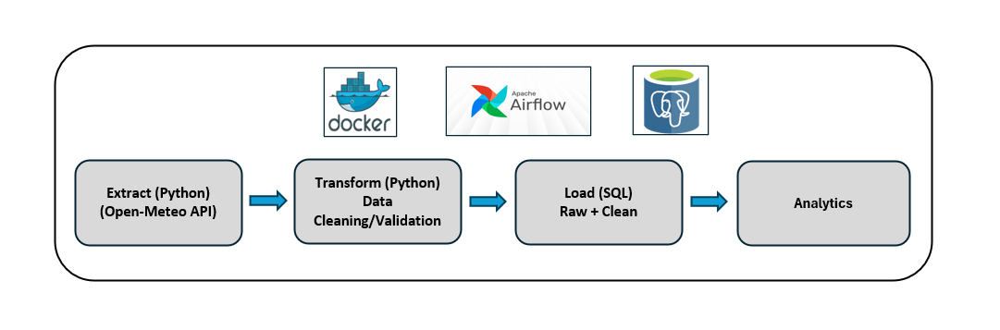
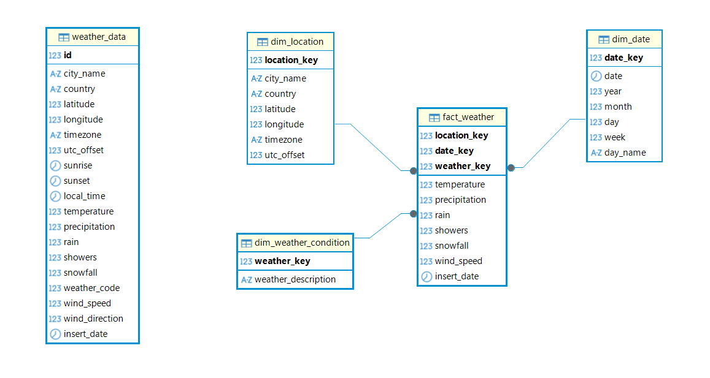
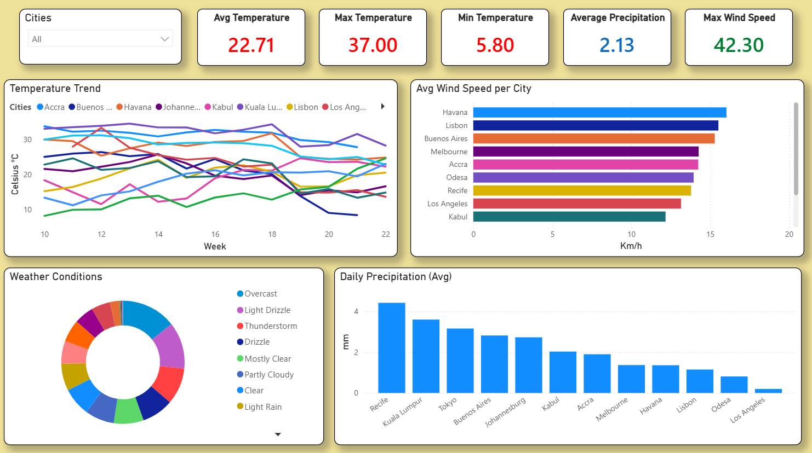

# Project: Weather Analytics ETL Pipeline

## Table of Contents
- [Project Overview](#overview)
- [Architecture Overview](#architecture)
- [Project Structure](#project-structure)
- [Database Schema](#database-schema)
- [ETL Workflow](#etl_workflow)
- [Installation and Setup](#installation-and-setup)
- [Technologies Used](#technologies_used)
- [Dashboard](#dashboard)

### Project Overview
This project implements a fully automated, end-to-end Weather Analytics ETL pipeline that:
- Extracts daily weather data from the Open-Meteo API
- Transforms and cleans the dataset with Python
- Loads raw and cleaned data into a PostgreSQL database
- Orchestrate workflow with Apache Airflow on a daily schedule
- Store logs
- Containerized deployment with Docker

### Architecture


### Project Structure
```text
weather-analytics-etl/
│
├── config/
│
├── dags/
│   └── weather_pipeline_dag.py
│   └── weather_hist_pipeline_dag.py
│
├── data/
│   ├── input/
│   ├── processed/
│   └── raw/
│
├── logs/
│
├── plugins/
│
├── postgres/
│   └── airflow_init.sql
│   └── weather_init.sql
│
├── scripts/
│   ├── __init__.py
│   ├── extract_daily_data.py
│   ├── extract_hist_data.py
│   ├── transform_daily_data.py
│   ├── transform_hist_data.py
│   ├── load_data.py
│   └── analytics_data.py
│
├── .env
├── docker-compose.yml
├── requirements.txt
└── README.md
```

### Database Schema


### ETL Workflow
**Extract Data**
- Call Open‑Meteo API endpopint daily
- Save raw data as timestamped JSON file

**Transform Data**
- Convert JSON to Pandas DataFrame
- Drop unnecessary column(s)
- Normalize timestamp column(s)
- Convert/calculate units
- Save cleaned data as timestamped CSV file

**Load**
- Load raw data into `weather_data`
- Load cleaned data into `fact_weather`

**Analytics**
- Daily weather summary
- 7‑day rolling trend 
- Monthly aggregate 

### Installation and Setup
```text
# 1. Create Required Folders
    - mkdir -p ./dags ./logs ./plugins ./config ./postgres
```
```text
# 2. Create a `.env` file
```
```text
# 3. Create and activate Virtual Environment
    - python -m venv your_venv
    - source your_env/bin/activate # Linux
    - your_env\Scripts\activate #Windows
```
```text
# 4. Install the required dependencies.
    - pip install -r requirements.txt
```
```text
# 5. Run all services with Docker (PostgreSQL & Airflow)
    - docker compose -f docker-compose.yml up -d
```
```text
# 6. Open Airflow UI
   - http://localhost:8000
```
```text
# 7. Enable the DAG: weather_pipeline_dag
```

### Technologies Used
- **Python** (requests, pandas)
- **Apache Airflow** (DAG orchestration)
- **PostgreSQL** (raw + analytics tables)
- **Docker Compose** (local deployment)
- **SQL** (DDL, DML)

### Dashboard

